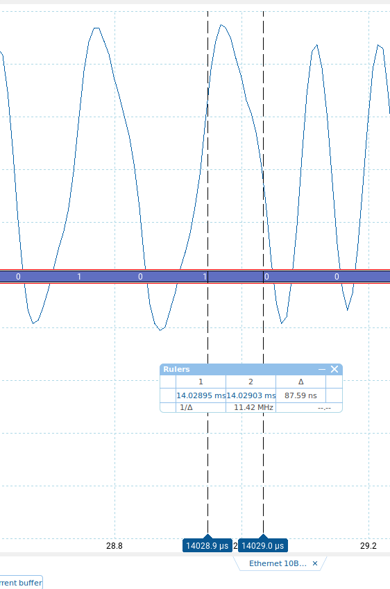
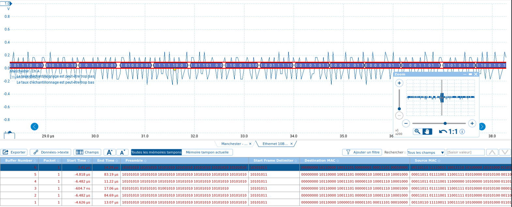
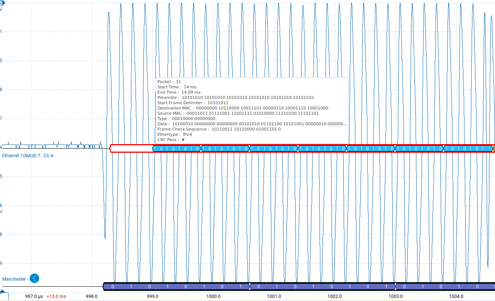
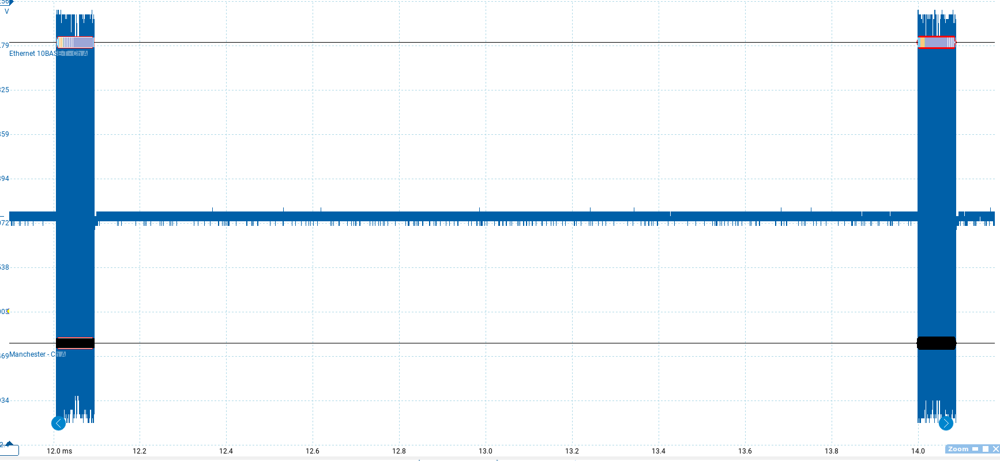
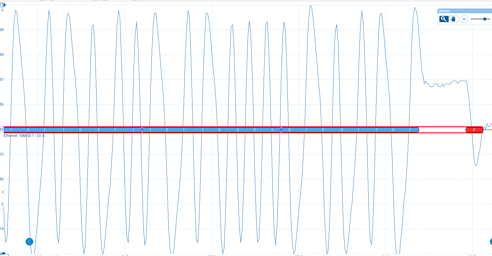
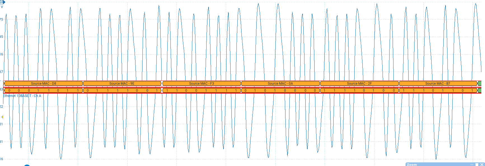
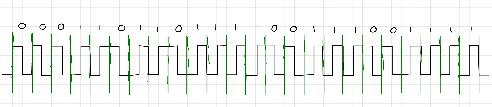

<h1 style="width: 100%; text-align:center;">Labo 1 : De la couche physique à la couche application</h1>
<h2 style="width: 100%; text-align:center;">Arian Dervishaj, Aymeric Gros</h2>
<h3 style="width: 100%; text-align:center;">13 octobre 2023</h3>

### 

<div style="page-break-after: always;"></div>

# Table des matières
- [Table des matières](#table-des-matières)
- [A. Préparation](#a-préparation)
  - [A.1 Quel champs dans le résultat de cette commande indique que le port est bien à 10 Mb/s ?](#a1-quel-champs-dans-le-résultat-de-cette-commande-indique-que-le-port-est-bien-à-10-mbs-)
  - [A.3 Que signifie « Duplex Full » au niveau de la couche physique ?](#a3-que-signifie--duplex-full--au-niveau-de-la-couche-physique-)
- [B. Encodage Ethernet en 10Mb/s](#b-encodage-ethernet-en-10mbs)
  - [B.1 Sur quel catégorie de câble Ethernet a lieu la capture ? Quelle vitesse maximum peut-il supporter sans pertes ?](#b1-sur-quel-catégorie-de-câble-ethernet-a-lieu-la-capture--quelle-vitesse-maximum-peut-il-supporter-sans-pertes-)
  - [B.2 Indiquer la durée par division que vous avez sélectionné ainsi que le taux d’échantillonnage](#b2-indiquer-la-durée-par-division-que-vous-avez-sélectionné-ainsi-que-le-taux-déchantillonnage)
  - [B.3 Quelle est l’amplitude en volts du signal mesuré ?](#b3-quelle-est-lamplitude-en-volts-du-signal-mesuré-)
  - [B.4 Quelle est la fréquence max du signal ? Est-ce que le signal est toujours à la même fréquence ? Expliquer](#b4-quelle-est-la-fréquence-max-du-signal--est-ce-que-le-signal-est-toujours-à-la-même-fréquence--expliquer)
  - [B.5 Est-ce que Ethernet dispose d’une ligne physique dédiée à transmettre l’horloge ? Expliquer pourquoi](#b5-est-ce-que-ethernet-dispose-dune-ligne-physique-dédiée-à-transmettre-lhorloge--expliquer-pourquoi)
  - [B.6 La transmission de donnée est-elle asynchrone ou synchrone ? Expliquez en effectuant au besoin une recherche sur Internet](#b6-la-transmission-de-donnée-est-elle-asynchrone-ou-synchrone--expliquez-en-effectuant-au-besoin-une-recherche-sur-internet)
  - [B.7 Quel est la vitesse du signal en baud ? en bit/s ? Est-ce la même valeur en baud et bit/s ? pourquoi ? Expliquez](#b7-quel-est-la-vitesse-du-signal-en-baud--en-bits--est-ce-la-même-valeur-en-baud-et-bits--pourquoi--expliquez)
  - [B.8 Quel est le débit binaire de la trame ? Justifier à l’aide d’une capture d’écran et l’utilisation de la règle de l’oscilloscope](#b8-quel-est-le-débit-binaire-de-la-trame--justifier-à-laide-dune-capture-décran-et-lutilisation-de-la-règle-de-loscilloscope)
  - [B.9 Expliquer à l’aide d’un schéma indiquant une séquence binaire pourquoi le codage utilisé est coûteux en fréquence](#b9-expliquer-à-laide-dun-schéma-indiquant-une-séquence-binaire-pourquoi-le-codage-utilisé-est-coûteux-en-fréquence)
  - [B.10 Quelle est le temps nécessaire pour envoyer un bit ?](#b10-quelle-est-le-temps-nécessaire-pour-envoyer-un-bit-)
  - [B.11 Mesurer le temps passé entre la transmission de deux bits consécutifs d’une trame ?](#b11-mesurer-le-temps-passé-entre-la-transmission-de-deux-bits-consécutifs-dune-trame-)
  - [B.12 Quel est le codage utilisé par la couche physique pour encoder/décoder l’information ?](#b12-quel-est-le-codage-utilisé-par-la-couche-physique-pour-encoderdécoder-linformation-)
  - [B.13 S’agit-il d’une modulation de phase, de fréquence ou d’amplitude ? Justifier](#b13-sagit-il-dune-modulation-de-phase-de-fréquence-ou-damplitude--justifier)
  - [B.14 Donner une séquence de bits qui implique un encodage manchester à la fréquence physique maximale. Retrouver cette séquence de bits identique sur la capture du picoscope et vérifier que le signal est effectivement à cette fréquence là à l’aide de la règle](#b14-donner-une-séquence-de-bits-qui-implique-un-encodage-manchester-à-la-fréquence-physique-maximale-retrouver-cette-séquence-de-bits-identique-sur-la-capture-du-picoscope-et-vérifier-que-le-signal-est-effectivement-à-cette-fréquence-là-à-laide-de-la-règle)
- [C. Framing Ethernet](#c-framing-ethernet)
  - [C.2 Comment est signalé le début d’une trame Ethernet ?](#c2-comment-est-signalé-le-début-dune-trame-ethernet-)
  - [C.3 Quelle est la durée mesurée entre deux trames ?](#c3-quelle-est-la-durée-mesurée-entre-deux-trames-)
  - [C.4 Comment Ethernet 10baseT détecte-t-il la fin d’une trame ? est-ce qu’il y a un marqueur de fin ?](#c4-comment-ethernet-10baset-détecte-t-il-la-fin-dune-trame--est-ce-quil-y-a-un-marqueur-de-fin-)
- [D. Adressage et encapsulation](#d-adressage-et-encapsulation)
  - [D.1 A partir du signal, décoder en binaire un byte du champs de données de la trame ainsi le champs type/length de la trame. Dans quel ordre sont transmis les bits sur media pour chaque champ ? : LSB first ou MSB first ?](#d1-a-partir-du-signal-décoder-en-binaire-un-byte-du-champs-de-données-de-la-trame-ainsi-le-champs-typelength-de-la-trame-dans-quel-ordre-sont-transmis-les-bits-sur-media-pour-chaque-champ---lsb-first-ou-msb-first-)
  - [D.2 A partir de l’interface du picoscope, retrouvez l’adresse ethernet source de votre PC ? Dessinez les 24 premiers bits sur une feuille avec le codage trouvé.](#d2-a-partir-de-linterface-du-picoscope-retrouvez-ladresse-ethernet-source-de-votre-pc--dessinez-les-24-premiers-bits-sur-une-feuille-avec-le-codage-trouvé)
- [E. Couche application et sockets](#e-couche-application-et-sockets)
  - [E.1 Exécutez le script.](#e1-exécutez-le-script)
- [F. Reflexion](#f-reflexion)
  - [F.1 Est-il possible de générer une Trame Ethernet depuis le picoscope en utilisant l’AWG (Arbitrary Waveform Generator). Expliquer pourquoi ?](#f1-est-il-possible-de-générer-une-trame-ethernet-depuis-le-picoscope-en-utilisant-lawg-arbitrary-waveform-generator-expliquer-pourquoi-)
  - [F.2 Le signal binaire à 10 Mb/s implique que chaque bit est envoyé en 0.1 microsecondes. Sur une paire torsadée en cuivre, le signal se propage à environ 74% de la vitesse de la lumlière (c’est à dire 0.74 \* 3\*10E8). Quelle est la taille d’un bit sur le câble ?](#f2-le-signal-binaire-à-10-mbs-implique-que-chaque-bit-est-envoyé-en-01-microsecondes-sur-une-paire-torsadée-en-cuivre-le-signal-se-propage-à-environ-74-de-la-vitesse-de-la-lumlière-cest-à-dire-074--310e8-quelle-est-la-taille-dun-bit-sur-le-câble-)

<div style="page-break-after: always;"></div>

# A. Préparation

## A.1 Quel champs dans le résultat de cette commande indique que le port est bien à 10 Mb/s ?


## A.3 Que signifie « Duplex Full » au niveau de la couche physique ?

En full-duplex, le canal de communication est bidirectionnel. C'est à dire que les deux parties peuvent communiquer l'une avec l'autre en meme temps.

# B. Encodage Ethernet en 10Mb/s

## B.1 Sur quel catégorie de câble Ethernet a lieu la capture ? Quelle vitesse maximum peut-il supporter sans pertes ?

Cat.6. Il peut supporter jusqu'a 10Gbits/s et jusqu'à 250MHz.

## B.2 Indiquer la durée par division que vous avez sélectionné ainsi que le taux d’échantillonnage

La durée par division est de 100 microsecondes et la taux d'échantillonage est de 300M/s.

## B.3 Quelle est l’amplitude en volts du signal mesuré ?

L'amplitude est de 2V.


## B.4 Quelle est la fréquence max du signal ? Est-ce que le signal est toujours à la même fréquence ? Expliquer

La fréquence maximale du signal est de 10.04 MHz. Le signal peut varier en fréquence en fonction de sa nature et des conditions de transmission. A noté que la fréquence du signal peut différe en fonction de la composante qui est représenté. Voir les remarques.

## B.5 Est-ce que Ethernet dispose d’une ligne physique dédiée à transmettre l’horloge ? Expliquer pourquoi

Ethernet ne dispose pas d'une ligne physique dédiée pour transmettre l'horloge. C'est parce que dans Ethernet, la synchronisation est gérée par la modulation de Manchester. Cette technique de codage incorpore l'horloge directement dans le signal en utilisant des transitions de signal pour indiquer les changements de bits, ce qui élimine le besoin d'une ligne distincte pour l'horloge.

## B.6 La transmission de donnée est-elle asynchrone ou synchrone ? Expliquez en effectuant au besoin une recherche sur Internet

En Ethernet, la transmission des données n'est pas synchronisée. On utilise une méthode appelée la détection de collision (CSMA/CD), où les périodes d'envoi de données ne suivent pas un horaire fixe. Si jamais deux appareils envoient des données en même temps et que cela provoque une collision, ils doivent attendre un moment avant de réessayer.

## B.7 Quel est la vitesse du signal en baud ? en bit/s ? Est-ce la même valeur en baud et bit/s ? pourquoi ? Expliquez

Baud : 10Mb/s

bit/s : 10Mb/s

En Manchester, la vitesse en baud est égale à la vitesse en bit/s. Car dans ce codage, chaque changement de phase représente un seul bit de données. Donc, pour chaque transition, il transmet un bit, ce qui signifie que la fréquence en baud et la vitesse en bit/s sont les mêmes, car chaque symbole équivaut à un bit.

## B.8 Quel est le débit binaire de la trame ? Justifier à l’aide d’une capture d’écran et l’utilisation de la règle de l’oscilloscope

10 millions de bits par secondes.

## B.9 Expliquer à l’aide d’un schéma indiquant une séquence binaire pourquoi le codage utilisé est coûteux en fréquence


Comme on peut le voir sur le schéma du dessus. L'encodage de Manchestrer fonctionne en divisant chaque bit de données en deux transitions, créant ainsi des transitions de signal pour chaque transition montante et descendante au milieu de la période de chaque bit. Cette division demande que lorsque deux bits consécutifs ont la même valeur (soit 00 ou 11), le signal doit rapidement changer de niveau en passant soit d'un niveau élevé à un niveau bas, soit d'un niveau bas à un niveau élevé. En conséquence, cette méthode double la fréquence du signal par rapport aux données brutes.

## B.10 Quelle est le temps nécessaire pour envoyer un bit ?

0.1 microseconde

## B.11 Mesurer le temps passé entre la transmission de deux bits consécutifs d’une trame ?



## B.12 Quel est le codage utilisé par la couche physique pour encoder/décoder l’information ?

Le codage de Manchester.



## B.13 S’agit-il d’une modulation de phase, de fréquence ou d’amplitude ? Justifier

Le codage de Manchester utilise des changements de phase pour représenter les bits. Un bit "0" est indiqué par un changement de phase descendant (haut vers bas), et un bit "1" est représenté par un changement de phase montant (bas vers haut). Cela en fait une méthode de modulation de phase.

## B.14 Donner une séquence de bits qui implique un encodage manchester à la fréquence physique maximale. Retrouver cette séquence de bits identique sur la capture du picoscope et vérifier que le signal est effectivement à cette fréquence là à l’aide de la règle

Un exemple de séquence serait "*00000000*" ou "*1111111*".

# C. Framing Ethernet

## C.2 Comment est signalé le début d’une trame Ethernet ?

Le début d'une trame ethernet est signalé par le préambule sur 7 octets.



## C.3 Quelle est la durée mesurée entre deux trames ?

La durée entre deux trames est d'environ 1.9 ms.



## C.4 Comment Ethernet 10baseT détecte-t-il la fin d’une trame ? est-ce qu’il y a un marqueur de fin ?

Il y'a une pause qui s'appelle un _Inter Frame Gap_ suivit d'un bit de valeur 0.



# D. Adressage et encapsulation

## D.1 A partir du signal, décoder en binaire un byte du champs de données de la trame ainsi le champs type/length de la trame. Dans quel ordre sont transmis les bits sur media pour chaque champ ? : LSB first ou MSB first ?

MSB first

## D.2 A partir de l’interface du picoscope, retrouvez l’adresse ethernet source de votre PC ? Dessinez les 24 premiers bits sur une feuille avec le codage trouvé.





# E. Couche application et sockets

Depuis l’un des PC de la salle, exécuter le script du client socket python suivant pour y indiquer un message à répéter en boucle sur le réseau

```python
import socket
import time

s=socket.socket(socket.AF_INET, socket.SOCK_DGRAM)

while True:
    s.sendto("Hello world".encode('ascii'),('1.1.1.1',1234))
    time.sleep(0.1)
```

## E.1 Exécutez le script.


Resultat du script capturé sur wireshark.

# F. Reflexion

## F.1 Est-il possible de générer une Trame Ethernet depuis le picoscope en utilisant l’AWG (Arbitrary Waveform Generator). Expliquer pourquoi ?

Non car les trames des paquets de données ethernet suivent des nrormes très strictes. Tout généré à la main serait trop complexe.

## F.2 Le signal binaire à 10 Mb/s implique que chaque bit est envoyé en 0.1 microsecondes. Sur une paire torsadée en cuivre, le signal se propage à environ 74% de la vitesse de la lumlière (c’est à dire 0.74 * 3*10E8). Quelle est la taille d’un bit sur le câble ?

1. Vitesse : 0.74 * 3 * 10^8 [m/s]
2. Temps pour envoyer 1 bit : 1 / 10^7 [1/s]
3. Taille d'un bit : Vitesse * Temps pour 1 bit = (0.74 * 3 * 10^8) * (1/10^7) =  22.2 [m]
