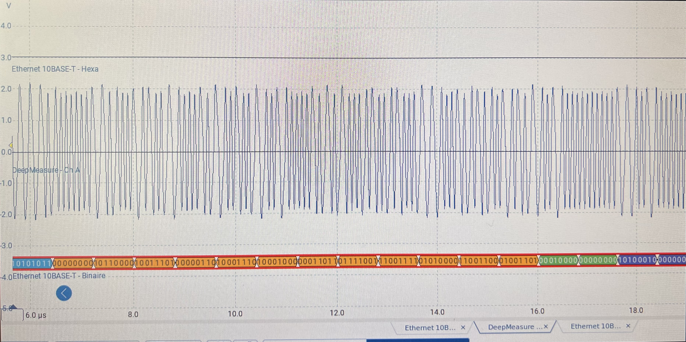
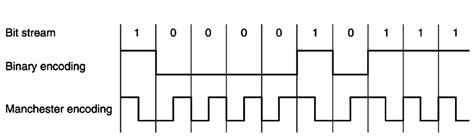

# labo

## A. Préparation

### A.1 Quel champs dans le résultat de cette commande indique que le port est bien à 10 Mb/s ?

### A.3 Que signifie « Duplex Full » au niveau de la couche physique ?

En full-duplex, le canal de communication est bidirectionnel. C'est à dire que les deux parties peuvent communiquer l'une avec l'autre en meme temps.

## B. Encodage Ethernet en 10Mb/s

### B.1 Sur quel catégorie de câble Ethernet a lieu la capture ? Quelle vitesse maximum peut-il supporter sans pertes ?

Cat.6. Il peut supporter jusqu'a 10Gbits/s et jusqu'à 250MHz.

### B.2 Indiquer la durée par division que vous avez sélectionné ainsi que le taux d’échantillonnage

La durée par division est de 100 microsecondes et la taux d'échantillonage est de 300M/s.

### B.3 Quelle est l’amplitude en volts du signal mesuré ?

L'amplitude est de 2V.

### B.4 Quelle est la fréquence max du signal ? Est-ce que le signal est toujours à la même fréquence ? Expliquer

La fréquence maximale du signal est de 10.04 MHz. Le signal peut varier en fréquence en fonction de sa nature et des conditions de transmission.

### B.5 Est-ce que Ethernet dispose d’une ligne physique dédiée à transmettre l’horloge ? Expliquer pourquoi

Ethernet ne dispose pas d'une ligne physique dédiée pour transmettre l'horloge. C'est parce que dans Ethernet, la synchronisation est gérée par la modulation de Manchester. Cette technique de codage incorpore l'horloge directement dans le signal en utilisant des transitions de signal pour indiquer les changements de bits, ce qui élimine le besoin d'une ligne distincte pour l'horloge.

### B.6 La transmission de donnée est-elle asynchrone ou synchrone ? Expliquez en effectuant au besoin une recherche sur Internet

En Ethernet, la transmission des données n'est pas synchronisée. On utilise une méthode appelée la détection de collision (CSMA/CD), où les périodes d'envoi de données ne suivent pas un horaire fixe. Si jamais deux appareils envoient des données en même temps et que cela provoque une collision, ils doivent attendre un moment avant de réessayer.

### B.7 Quel est la vitesse du signal en baud ? en bit/s ? Est-ce la même valeur en baud et bit/s ? pourquoi ? Expliquez

Baud : ?????

bit/s : ?????

En Manchester, la vitesse en baud est égale à la vitesse en bit/s. Car dans ce codage, chaque changement de phase représente un seul bit de données. Donc, pour chaque transition, il transmet un bit, ce qui signifie que la fréquence en baud et la vitesse en bit/s sont les mêmes, car chaque symbole équivaut à un bit.

### B.8 Quel est le débit binaire de la trame ? Justifier à l’aide d’une capture d’écran et l’utilisation de la règle de l’oscilloscope

Pas accès aux machines

### B.9 Expliquer à l’aide d’un schéma indiquant une séquence binaire pourquoi le codage utilisé est coûteux en fréquence

Comme on peut le voir sur le schéma du dessus. L'encodage de Manchestrer fonctionne en divisant chaque bit de données en deux transitions, créant ainsi des transitions de signal pour chaque transition montante et descendante au milieu de la période de chaque bit. Cette division demande que lorsque deux bits consécutifs ont la même valeur (soit 00 ou 11), le signal doit rapidement changer de niveau en passant soit d'un niveau élevé à un niveau bas, soit d'un niveau bas à un niveau élevé. En conséquence, cette méthode double la fréquence du signal par rapport aux données brutes.

### B.10 Quelle est le temps nécessaire pour envoyer un bit ?

Pas accès aux machines

### B.11 Mesurer le temps passé entre la transmission de deux bits consécutifs d’une trame ?

Plus accès aux machines.

### B.12 Quel est le codage utilisé par la couche physique pour encoder/décoder l’information ?

Le codage de Manchester.

### B.13 S’agit-il d’une modulation de phase, de fréquence ou d’amplitude ? Justifier

Le codage de Manchester utilise des changements de phase pour représenter les bits. Un bit "0" est indiqué par un changement de phase descendant (haut vers bas), et un bit "1" est représenté par un changement de phase montant (bas vers haut). Cela en fait une méthode de modulation de phase.

### B.14 Donner une séquence de bits qui implique un encodage manchester à la fréquence physique maximale. Retrouver cette séquence de bits identique sur la capture du picoscope et vérifier que le signal est effectivement à cette fréquence là à l’aide de la règle

Un exemple de séquence serait "00000000" ou "1111111".