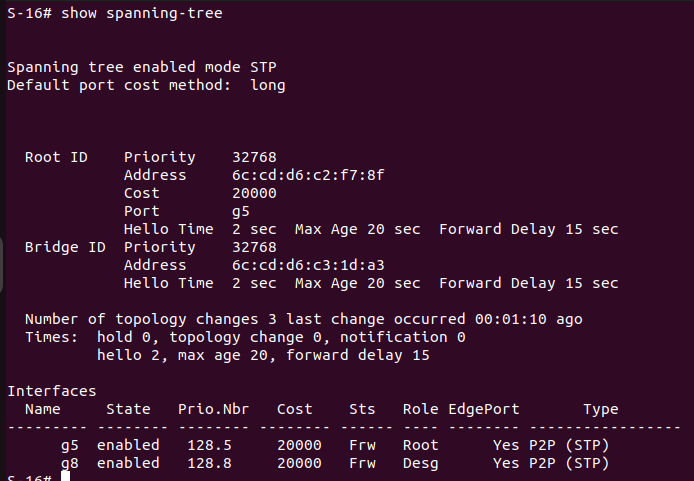
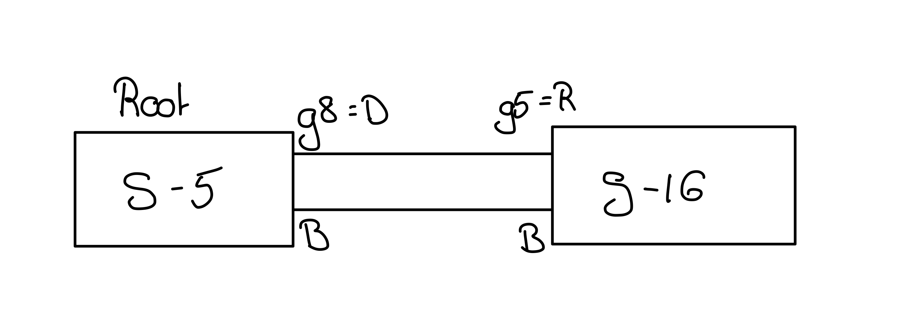
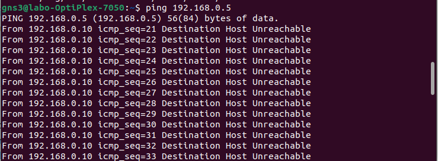
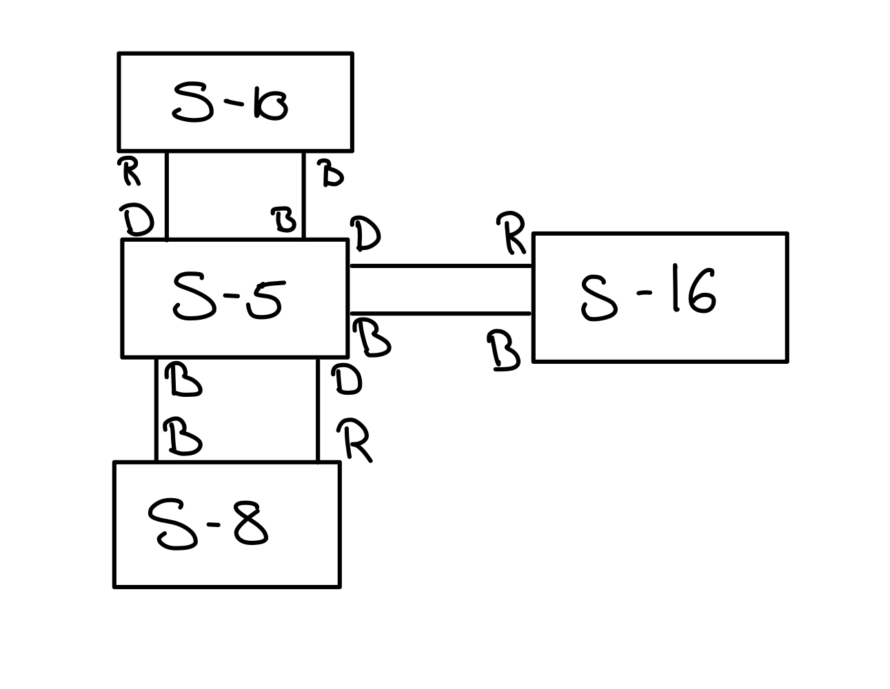
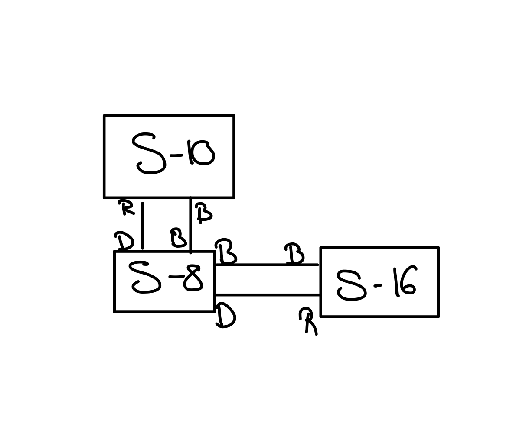

<h1 style="width: 100%; text-align:center;">Labo 2 : Management de switch et Spanning Tree Protocol (STP)</h1>
<h2 style="width: 100%; text-align:center;">Arian Dervishaj, Aymeric Gros</h2>

<div style="page-break-after: always;"></div>

- [A. Configuration de base du switch](#a-configuration-de-base-du-switch)
  - [A1. Combien d’adresses MAC peut contenir la table du switch GS308T au maximum ?](#a1-combien-dadresses-mac-peut-contenir-la-table-du-switch-gs308t-au-maximum-)
  - [A2. A quel vitesse en Mb/s le switch peut-ils commuter des trames ?](#a2-a-quel-vitesse-en-mbs-le-switch-peut-ils-commuter-des-trames-)
  - [A3. Quelle est la taille du buffer utilisé pour commutation ? A combien de trames Ethernet de taille maximum et minimum cela correspond ?](#a3-quelle-est-la-taille-du-buffer-utilisé-pour-commutation--a-combien-de-trames-ethernet-de-taille-maximum-et-minimum-cela-correspond-)
- [B. Mise en place du réseau et création d’une boucle réseau](#b-mise-en-place-du-réseau-et-création-dune-boucle-réseau)
  - [B5. Comment réagissent les switch ? Est-ce qu’ils sont toujours joignables par ssh ? Est-ce que ping d’un PC à l’autre fonctionne toujours ?](#b5-comment-réagissent-les-switch--est-ce-quils-sont-toujours-joignables-par-ssh--est-ce-que-ping-dun-pc-à-lautre-fonctionne-toujours-)
  - [B6. Enlever la boucle du réseau en débranchant l’un des câbles responsables. Comment réagit le switch ?](#b6-enlever-la-boucle-du-réseau-en-débranchant-lun-des-câbles-responsables-comment-réagit-le-switch-)
  - [B8. Donner la séquence de traitement/commutation local des paquets sur le switch qui provoque cette boucle pour chaque switch. Est ce que la table du switch contient une entrée pour l'addresse FF:FF:FF:FF:FF:FF ?](#b8-donner-la-séquence-de-traitementcommutation-local-des-paquets-sur-le-switch-qui-provoque-cette-boucle-pour-chaque-switch-est-ce-que-la-table-du-switch-contient-une-entrée-pour-laddresse-ffffffffffff-)
- [C. Détermination de l’arbre couvrant STP](#c-détermination-de-larbre-couvrant-stp)
  - [C1. Qui est le switch racine ? Pourquoi ? Donner la commande pour le retrouver et faites une capture d’écran.](#c1-qui-est-le-switch-racine--pourquoi--donner-la-commande-pour-le-retrouver-et-faites-une-capture-décran)
  - [C2. Quels sont les ports racines ? Les ports désignés ? les ports bloqués ?](#c2-quels-sont-les-ports-racines--les-ports-désignés--les-ports-bloqués-)
  - [C3. Dessinez l’arbre couvrant construit par le protocole STP.](#c3-dessinez-larbre-couvrant-construit-par-le-protocole-stp)
- [D. Extension du réseau et vérification de topologie avec Link Layer Discovery Protocol (LLDP)](#d-extension-du-réseau-et-vérification-de-topologie-avec-link-layer-discovery-protocol-lldp)
  - [D1. A quoi sert le champs TTL dans le tableau indiqué par le protocole LLDP ? Aidez vous de la documentation sur LLDP pour trouver la réponse.](#d1-a-quoi-sert-le-champs-ttl-dans-le-tableau-indiqué-par-le-protocole-lldp--aidez-vous-de-la-documentation-sur-lldp-pour-trouver-la-réponse)
- [E. Création d’une boucle étendue](#e-création-dune-boucle-étendue)
  - [E1. Comment réagissent les switches sur cette nouvelle boucle ?](#e1-comment-réagissent-les-switches-sur-cette-nouvelle-boucle-)
  - [E2. Tentez de retirer la boucle à la main sans couper la connectivité entre les PC. Arrivez-vous à déterminer où se trouve la boucle facilement ?](#e2-tentez-de-retirer-la-boucle-à-la-main-sans-couper-la-connectivité-entre-les-pc-arrivez-vous-à-déterminer-où-se-trouve-la-boucle-facilement-)
- [F. Arbres couvrant sur la nouvelle topologie](#f-arbres-couvrant-sur-la-nouvelle-topologie)
  - [F1. Réactiver STP sur tous les switches et déterminer la racine construite par l’algorithme.](#f1-réactiver-stp-sur-tous-les-switches-et-déterminer-la-racine-construite-par-lalgorithme)
  - [F2. Est-ce que la racine à changé par rapport à la topologie précédente ? Pourquoi ?](#f2-est-ce-que-la-racine-à-changé-par-rapport-à-la-topologie-précédente--pourquoi-)
  - [F3. Dessiner l’arbre couvrant de la topologie étendue.](#f3-dessiner-larbre-couvrant-de-la-topologie-étendue)
  - [F4. Pouvez-vous prédire quel autre switch sera élu racine si on débranche le switch racine de la topologie ? Comment ?](#f4-pouvez-vous-prédire-quel-autre-switch-sera-élu-racine-si-on-débranche-le-switch-racine-de-la-topologie--comment-)
  - [F5. Vérifier si votre prédiction est juste en débranchant le switch racine.](#f5-vérifier-si-votre-prédiction-est-juste-en-débranchant-le-switch-racine)
  - [F6. Combien de temps prends la ré-élection du la nouvelle racine ? Déterminez le en pingant le switch à intervalle d’une seconde pendant le changement. Montrez par un capture d’écran de la ligne de commande que la racine a effectivement changé en utilisant la commande:](#f6-combien-de-temps-prends-la-ré-élection-du-la-nouvelle-racine--déterminez-le-en-pingant-le-switch-à-intervalle-dune-seconde-pendant-le-changement-montrez-par-un-capture-décran-de-la-ligne-de-commande-que-la-racine-a-effectivement-changé-en-utilisant-la-commande)
  - [F7. Redessinez le nouvel arbre couvrant sur une feuille avec indication des ports racines et des ports désignés.](#f7-redessinez-le-nouvel-arbre-couvrant-sur-une-feuille-avec-indication-des-ports-racines-et-des-ports-désignés)
  - [F8. Combien de temps prends environ la ré-électrion du switch racine ? Expliquez où est passé ce temps ?](#f8-combien-de-temps-prends-environ-la-ré-électrion-du-switch-racine--expliquez-où-est-passé-ce-temps-)
  - [F10. On aimerait rajouter un switch sur la topologie, sans qu’il devienne racine. Comment doit-on le configurer pour être sûr que celà ne sera pas le cas ?](#f10-on-aimerait-rajouter-un-switch-sur-la-topologie-sans-quil-devienne-racine-comment-doit-on-le-configurer-pour-être-sûr-que-celà-ne-sera-pas-le-cas-)
- [G. Reflexions et fin du labo.](#g-reflexions-et-fin-du-labo)
  - [G1. Comment STP converge-t-il ? Faites une recherche sur Internet sur les états possibles des ports lorsque la convergence de STP et expliquez ce qu’ils signifient](#g1-comment-stp-converge-t-il--faites-une-recherche-sur-internet-sur-les-états-possibles-des-ports-lorsque-la-convergence-de-stp-et-expliquez-ce-quils-signifient)


# A. Configuration de base du switch

## A1. Combien d’adresses MAC peut contenir la table du switch GS308T au maximum ?

Il peut contenir 8k addresse mac.

## A2. A quel vitesse en Mb/s le switch peut-ils commuter des trames ?

A 16 Gb/s

## A3. Quelle est la taille du buffer utilisé pour commutation ? A combien de trames Ethernet de taille maximum et minimum cela correspond ?

512kb

# B. Mise en place du réseau et création d’une boucle réseau

## B5. Comment réagissent les switch ? Est-ce qu’ils sont toujours joignables par ssh ? Est-ce que ping d’un PC à l’autre fonctionne toujours ?

Les switchs clignotent beaucoup.
Pas joignable par ssh "no route to host".
Les pings ne passent plus non plus.


## B6. Enlever la boucle du réseau en débranchant l’un des câbles responsables. Comment réagit le switch ?

Lorsqu'on débranche, le switch arretent de clignoter.
Le ping ne fonctionne toujours pas. (on a cassé le switch pour le reparer on a reboot le switch)
Le ssh fonctionne.

## B8. Donner la séquence de traitement/commutation local des paquets sur le switch qui provoque cette boucle pour chaque switch. Est ce que la table du switch contient une entrée pour l'addresse FF:FF:FF:FF:FF:FF ?

La table n'a pas d'entrée pour FF:FF:FF:FF:FF:FF car c'est du broadcast et le but du broadcast est d'envoyé sur toutes les sorties.

# C. Détermination de l’arbre couvrant STP

## C1. Qui est le switch racine ? Pourquoi ? Donner la commande pour le retrouver et faites une capture d’écran.

La racine est le switch S-5. Car sur le S-16 on voit que le port g5 pointe vers la racine

La commande est

```bash
show spanning tree
```



## C2. Quels sont les ports racines ? Les ports désignés ? les ports bloqués ?

Ports racines : g5 du switch 16
Ports designées : G8, du switch 16 et G2,G5 du switch 5

## C3. Dessinez l’arbre couvrant construit par le protocole STP.



# D. Extension du réseau et vérification de topologie avec Link Layer Discovery Protocol (LLDP)

## D1. A quoi sert le champs TTL dans le tableau indiqué par le protocole LLDP ? Aidez vous de la documentation sur LLDP pour trouver la réponse.

Le TTL est Time to live c'est à dire le temps que les données restent dans la table du switch.

# E. Création d’une boucle étendue

## E1. Comment réagissent les switches sur cette nouvelle boucle ?



Les leds clignotent et les switchs ne fonctionnent plus.


## E2. Tentez de retirer la boucle à la main sans couper la connectivité entre les PC. Arrivez-vous à déterminer où se trouve la boucle facilement ?

Pour retirer la boucle à la main, on a du retirer un cables dans tout les switchs qui étaient liés.

# F. Arbres couvrant sur la nouvelle topologie

## F1. Réactiver STP sur tous les switches et déterminer la racine construite par l’algorithme.

La racine construite par l'algorithme est le switch S5.
Car le switch S5 a une mac addresse plus petite que les switch S16,S10,S8


## F2. Est-ce que la racine à changé par rapport à la topologie précédente ? Pourquoi ?

C'est la même car le switch ayant la MAC addresse la plus petite est le même.

## F3. Dessiner l’arbre couvrant de la topologie étendue.



## F4. Pouvez-vous prédire quel autre switch sera élu racine si on débranche le switch racine de la topologie ? Comment ?

Si le switch racine est débranchée alors le deuxième switch avec la MAC addresse devient le switch car la priorité de tous les switchs est le même. Dans notre cas le switch S8 sera le prochain switch root.

## F5. Vérifier si votre prédiction est juste en débranchant le switch racine.

Notre prédiction était correcte. Le nouveau switch est bien le S8.

## F6. Combien de temps prends la ré-élection du la nouvelle racine ? Déterminez le en pingant le switch à intervalle d’une seconde pendant le changement. Montrez par un capture d’écran de la ligne de commande que la racine a effectivement changé en utilisant la commande:

Le temps de ré-élection est de 30 secondes. 

## F7. Redessinez le nouvel arbre couvrant sur une feuille avec indication des ports racines et des ports désignés.



## F8. Combien de temps prends environ la ré-électrion du switch racine ? Expliquez où est passé ce temps ?

Une trentaine de secondes, le temps de découvrir la topologie, calculer le chemin optimal, mettre a jour les tables des switchs et faire la convergences des ports.

## F10. On aimerait rajouter un switch sur la topologie, sans qu’il devienne racine. Comment doit-on le configurer pour être sûr que celà ne sera pas le cas ?

Soit on choisit un switch ayant une mac addresse plus grande que la racine. Soit on change la propriété "Bridge Priority" afin qu'elle soit supérieur à celle du switch.

# G. Reflexions et fin du labo.

## G1. Comment STP converge-t-il ? Faites une recherche sur Internet sur les états possibles des ports lorsque la convergence de STP et expliquez ce qu’ils signifient

1. Blocking : Les ports bloqués ne transfèrent pas de données mais écoutent les trames BPDU (Bridge Protocol Data Unit) pour détecter les boucles potentielles. Dans cet état, le port ne participe pas au transfert de données.

2. Listening : Les ports en attente sont en phase de transition vers l'état suivant. Ils écoutent également les trames BPDU mais commencent à annoncer leur propre existence et leur rôle.

3. Learning : Les ports en mode learning continuent d'écouter les trames BPDU et commencent également à apprendre les adresses MAC des périphériques connectés. Il n'y a toujours pas de transfert de données.

4. Forwarding : Les ports en mode de transfert transferent les données entre les périphériques connectés. Le port est fonctionnel.