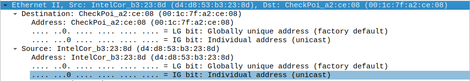

# Encapsulation des données et Wireshark

## Labo 0

### Arian Dervishaj

## A. Capture d’un message ping avec Wireshark

### A.1 Addresse IPV4 du réseau

10.136.205.47

## B. Analyse des champs du protocole ICMP

### B.1 Trouvez, pour les messages ICMP request : l’adresse IP source et l’adresse IP destination

**Source** : 10.136.205.47

**Destination** : 172.217.168.78

L'addresse source est la même addresse que l'on a noté à la quesiton A.1.

### B.2 Faites de même pour les messages ICMP response. Que remarquez-vous ?

**Source** : 172.217.168.78

**Destination** : 10.136.205.47

Les addresses sont inversées par rapport à la question B.1.

### B.3 Pour le champs destination, avez-vous la même valeur de vos collègues ?

Non ?

### B.4 Trouvez, pour les messages ICMP request et response, l’adresse ethernet source et destination

#### Request

- Source : IntelCor_b3:23:8d (d4:d8:53:b3:23:8d)
- Destination : CheckPoi_a2:ce:08 (00:1c:7f:a2:ce:08)

#### Reply

- Source : CheckPoi_a2:ce:08 (00:1c:7f:a2:ce:08)
- Destination : IntelCor_b3:23:8d (d4:d8:53:b3:23:8d)

### B.5 Que remarquez-vous ?

L'addresse source en request est l'addresse destination en reply.
L'addresse destination en request est l'addresse source en reply.

## C. Encapsulation

### C.1 Décrivez, en détails comment est encapsulé un message ICMP dans un paquet IP, dans une trame Ethernet vers google.com

Couche Application (7) :
L'utilisateur exécute une commande ping dans un terminal.

Couche Transport (4) :
Le message ICMP est transmis à la couche IP.

Couche Réseau (3) :
L'adresse IP de destination est déterminée en résolvant le nom "google.com" en une adresse IP à l'aide de protocoles de résolution DNS.
Le message ICMP est encapsulé dans un paquet IP. L'adresse IP source et l'adresse IP de destination sont spécifiées dans l'en-tête IP.
L'en-tête IP contient également des informations telles que le numéro de protocole ICMP (1) pour indiquer qu'il s'agit d'un message ICMP.

Couche Liaison de données (2) :
Le paquet IP est encapsulé dans une trame Ethernet.
L'adresse MAC source est celle de l'interface réseau de l'émetteur, tandis que l'adresse MAC de destination est celle du routeur ou de la passerelle par défaut.
L'en-tête Ethernet contient également des informations de type pour indiquer qu'il s'agit d'un paquet IP.

Couche Physique (1) :
La trame Ethernet est transmise sur le support physique, qu'il s'agisse d'un câble Ethernet, d'une connexion Wi-Fi, etc.

### C.2 pingez maintenant bbb.hesge.ch et refaites la même analyse que pour google.com. Est-ce que les adresses Ethernet source et destination ont changé ? Même question pour les adresses IP source et destination

Les addresses Ethernet sont les mêmes. L'addresse IP source d'un request est la même mais l'addresse IP de la destination est devenue 195.176.241.204.

### C.3 pinger maintenant <www.infomaniak.ch>, Est-ce que les adresses ethernet et destination on changé par rapport à google.com ? Pouvez-vous expliquer pourquoi à l’aide de ce que vos savez sur l’encapsulation ? Est-ce les adresses IP ont changé par rapport à google.com ?

Les addresses ethernet sont les mêmes que pour google.com.
L'addresse IP de la source du request est la même, c'est à dire 10.136.205.47. Cependant l'IP de la destination a changé, elle est devenue : 185.125.25.1.
